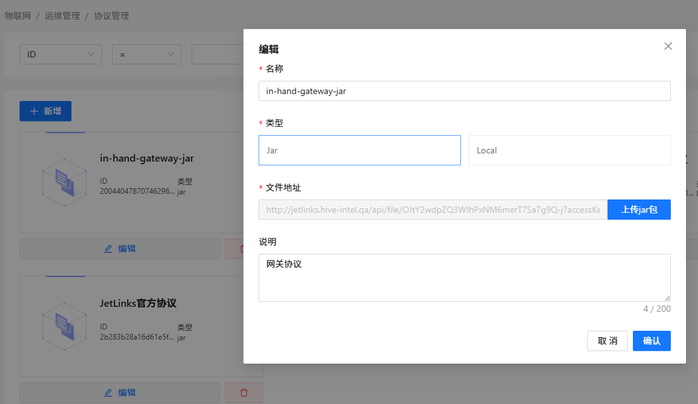
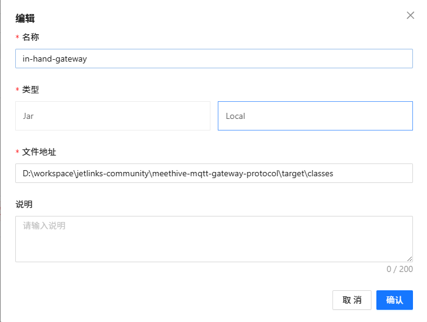
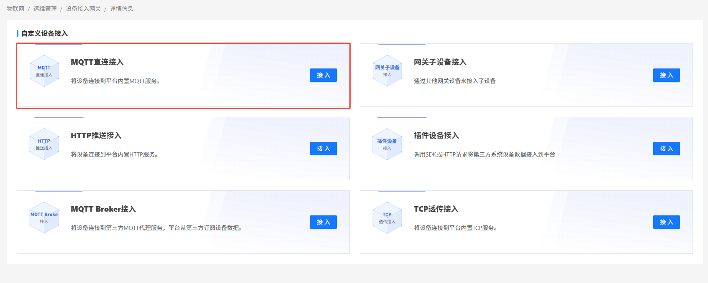
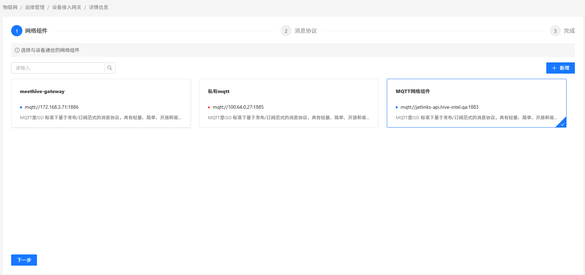
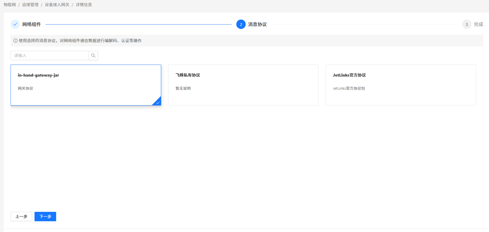
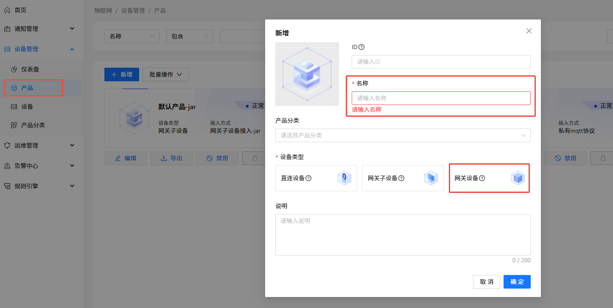
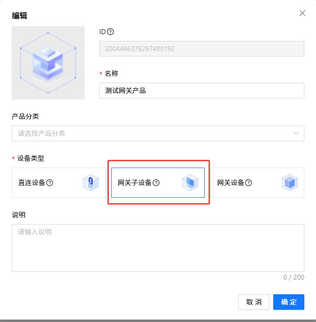
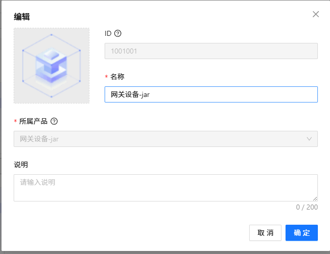

这里只梳理最基础的接入流程，下面以 MQTT 网关协议作为示例

1. 协议管理
   1. 协议包的开发 https://hanta.yuque.com/px7kg1/dev/hg5r4psvn9fdsv1c
      1. Linux 或者 Mac os
          ```shell
         mvn dependency:get \
         -DremoteRepositories=https://nexus.jetlinks.cn/content/groups/public \
         -DgroupId=org.jetlinks.protocol \
         -DartifactId=protocol-archetype \
         -Dversion=1.1.0-SNAPSHOT \
         && \
         mvn archetype:generate \
         -DarchetypeGroupId=org.jetlinks.protocol \
         -DarchetypeArtifactId=protocol-archetype \
         -DarchetypeVersion=1.1.0-SNAPSHOT \
         -DoutputDirectory=./ \
         -DgroupId=com.domain \
         -DartifactId=custom-protocol \
         -Dversion=1.0 \
         -DarchetypeCatalog=local \
         -DinteractiveMode=false
          ```
      2. Windows
         ```shell
         mvn dependency:get `
         -DremoteRepositories="https://nexus.jetlinks.cn/content/groups/public" `
         -DgroupId="org.jetlinks.protocol" `
         -DartifactId="protocol-archetype" `
         -Dversion="1.1.0-SNAPSHOT"
         ;

         mvn archetype:generate `
         -DarchetypeGroupId="org.jetlinks.protocol" `
         -DarchetypeArtifactId="protocol-archetype" `
         -DarchetypeVersion="1.1.0-SNAPSHOT" `
         -DoutputDirectory="./" `
         -DgroupId="com.domain" `
         -DartifactId="custom-protocol" `
         -Dversion="1.0" `
         -DarchetypeCatalog="local" `
         -DinteractiveMode="false"
         ```
      编写实现自己的网关逻辑，完成后打包上传至 jetlinks，如果本地测试，优先使用local类型，文件地址参考：`D:\workspace\jetlinks-community\meethive-mqtt-gateway-protocol\target\classes`；
   
      >注意：协议项目建议与jetlinks项目放在同一目录下，方便管理IDE调试可以进行断点调试。
   
   2. 编写好自己的对接协议后再此页面上传接口
      上传协议包
      Jar 类型
      
      Local 类型
      
2. 网络组件
   创建对应的网络组件，为绑定协议做准备
   
3. 设备接入网关新增

   1. 接入方式 -> 选择 `MQTT直连接入`
   
   2. 网络组件 -> 选择 `MQTT网络组件`  
   
   3. 消息协议 -> 选择 `网关协议`
   
   4. 填写必要信息，完成设备接入网关新增
   5. 创建网关子设备，重复以上操作，第一步选择 `网关子设备接入`

   > 注意：创建网关子设备时，请在第一步选择 `网关子设备接入`，其余步骤与上面一致。

4. 创建产品
   1. 创建网关产品 - 设备类型选择 `网关设备`
      
   2. 点击卡片 - 选择第3步创建的接入方式 `MQTT 网关接入`
   3. 设置用户名密码
   4. 启用产品
   5. 创建 `网关子设备` 产品，步骤同创建网关产品，设备类型选择 `网关子设备`
      
5. 创建设备 - 选择`所属产品`创建对应的设备即可
   

原文：jetlinks 官方文档：https://hanta.yuque.com/px7kg1/yfac2l